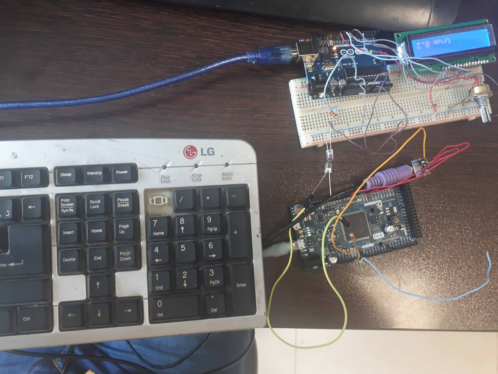

# VisualLightCommunication
sending data over LED using arduino
there are two arduinos to send data through LED and recieve it by another one
# Arduino
we are using arduino DUE as transmitter and arduino UNO as receiveer. [this decision is based on better abilty of arduino DUE to process sound for the next step of project. however there are libraries for arduino zero and UNO to play audio and read from SDCARD.(next step)]

# Code
the VLC project works exactly like a radio. actually an "unsynchronized" one and there is need of synchronization because of ambiguous starting point of data(in index), So we add preamble which is a fixed 16 bit codeword to lock at the index of start of the data.

we use Hardware timers and set the timer counter to zero when it synchronizes so as not to lose a bit of data and consequently the codeword.

# pre-requisits
below libraries are need for this project to work
PS2Keyboard.h
DUETimer.h
the first one could be downloaded from https://github.com/PaulStoffregen/PS2Keyboard and unzipped into  C:/Users/{User_Name}/Documents/Arduino/Libraries/(the library name should be here as folder)
the second one could be found in the library menu as "DUETimer" or download from the link below , copying it into C:/Users/{User_Name}/Documents/Arduino/Libraries.
# Results
when the hardwaretimers are set to have 50 milliseconds of count, the results are more precise than 10 milliseconds timer but the buffer is used and the data take time to pass through the LED. 

# Bonus
A ps/2 keyboard is used to eliminiate the serial usage as data provider and make the project more structured.

